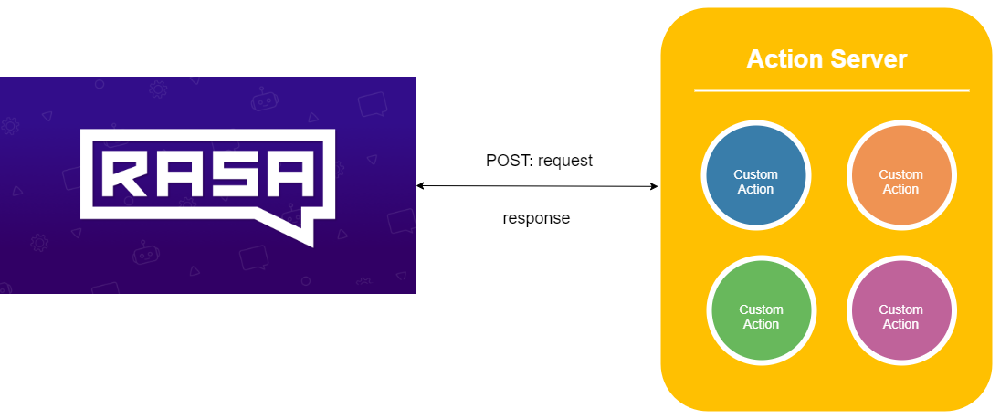

# Rasa Java Action Server
Action server for the Rasa custom actions

You can use this implementation of the action server as a starting point for your own chatbot based on [Rasa](https://rasa.com/).

Using the action server, you can focus on the business logic (defined within custom actions). Everything else is already done for you.

Rasa Core sends a request to the action server to execute a certain custom action. As a response to the action call from Core, you can modify the tracker, e.g. by setting slots and send responses back to the user.



Action server exposes an API that is used by Rasa to execute custom actions. The following endpoints are supported:

| Endpoint    | Description           |
|----------------|-----------------------------------|
| GET /health        | Ping endpoint to check if the server is running and well.              |
| GET /actions        | List all registered actions.              |
| POST /webhook        | It allows you to run the custom action. This endpoint should be set in the ``endpoints.yml`` file in Rasa.              |

## Usage

Before starting the action server ensure that contains your custom action.

#### 1. Adding custom actions

You can create two types of custom actions:
- **general** - which corresponds to [Rasa Custom Action](https://rasa.com/docs/rasa/core/actions/#custom-actions). To use this kind of actions, you can create a Java class which implement the ``io.github.rbajek.rasa.sdk.action.Action`` interface.
- **forms** - which corresponds to [Rasa Forms](https://rasa.com/docs/rasa/core/forms/). Ths kind of actions should extends the ``io.github.rbajek.rasa.sdk.action.form.AbstractFormAction``

To add your custom action, you can create a Java class which implement/extend an appropriate interface/class. Recommended package for your custom actions is ``io.github.rbajek.rasa.action.server.action.custom``. Afterwards, you have to register your custom action in ``io.github.rbajek.rasa.sdk.ActionExecutor``. 

**Tip:** If you want your custom action to be automatically registered, you action has to be as Spring component.


**Attention:** action server contains two examples of custom actions:
- [ActionJoke.java](https://github.com/rbajek/rasa-java-action-server/blob/master/src/main/java/io/github/rbajek/rasa/action/server/action/custom/joke/ActionJoke.java) - as the general action (based on [original example](https://rasa.com/docs/rasa/user-guide/running-rasa-with-docker/#creating-a-custom-action))
- [RestaurantFormAction.java](https://github.com/rbajek/rasa-java-action-server/blob/master/src/main/java/io/github/rbajek/rasa/action/server/action/custom/form/restaurant/RestaurantFormAction.java) - as the form action, which implement functionality of [Restaurant Form](https://blog.rasa.com/building-contextual-assistants-with-rasa-formaction/)

#### 2. Starting the actio server

In order to start the action server using implemented custom actions, fisrt of all, you have to build the application:

```
mvnw clean package
```

next, you ca run server as follows:

```
java -jar target\rasa-java-action-server.jar
```

##### Docker

If you are using docker you can build the docker image:

```
docker build -t rasa-action-server:1.0.0
```

and tun it:

```
docker run -p 8080:8080 --name my-rasa-action-server java-action-server:2.0
```

#### 3. Set the URL in Rasa Core

Rasa core has to know what is the URL of your custom server. To set this, you have to set the ``/webhook`` endpoint in the ``endpoints.yml`` within the Rasa server (see [custom action](https://rasa.com/docs/rasa/core/actions/#custom-actions)):

For example:

```yml
action_endpoint:
  url: "http://localhost:5055/webhook"
```
